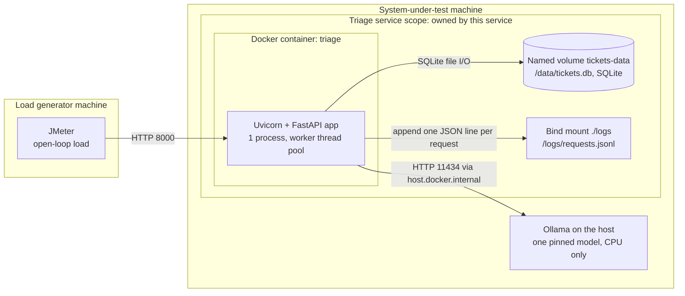
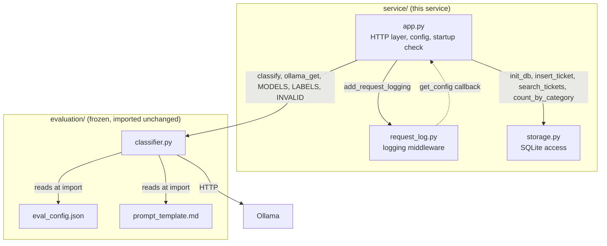
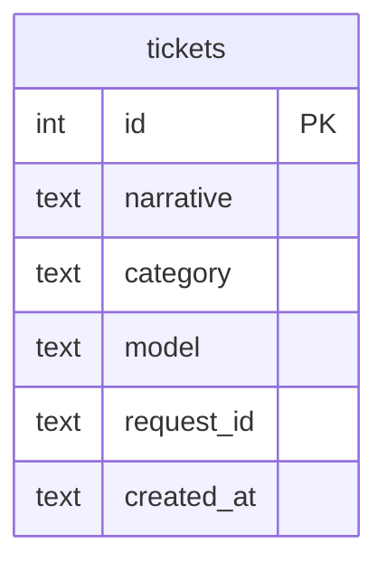
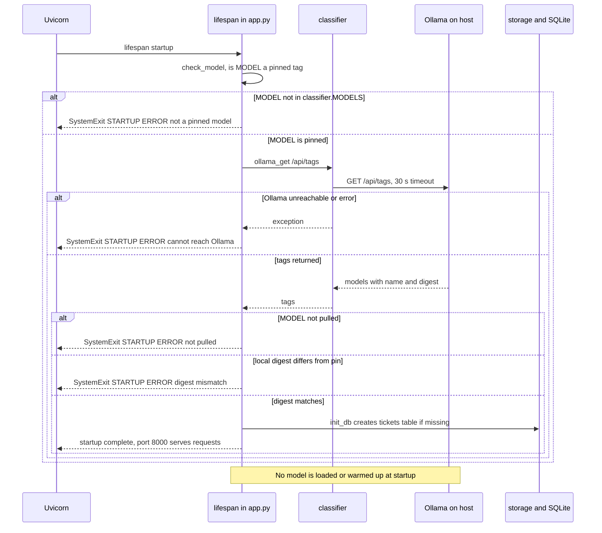
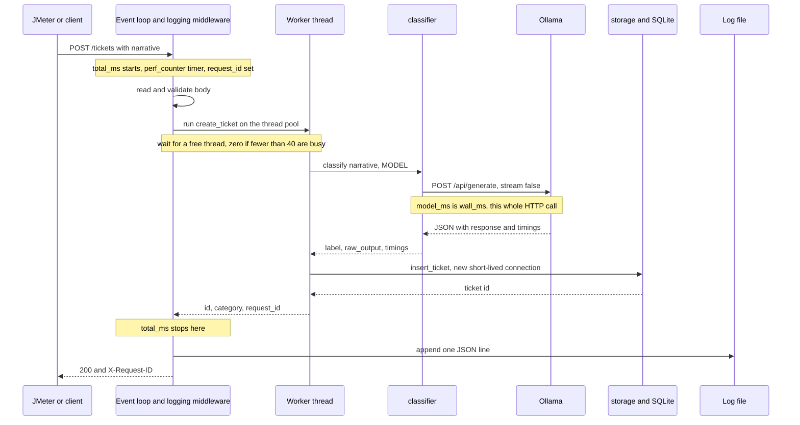
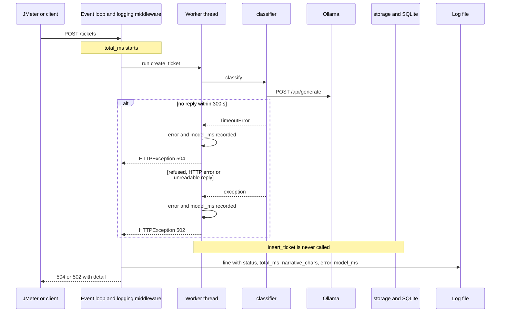
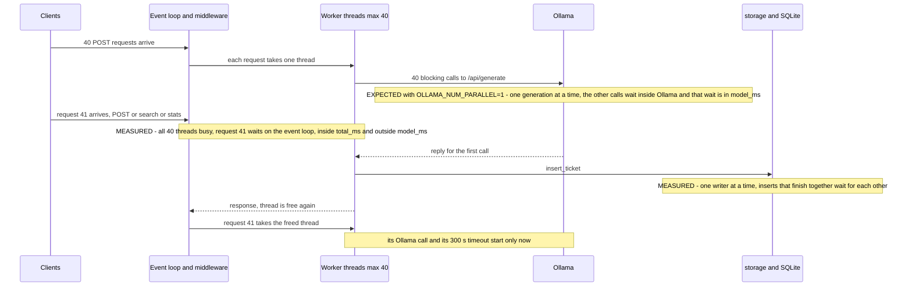
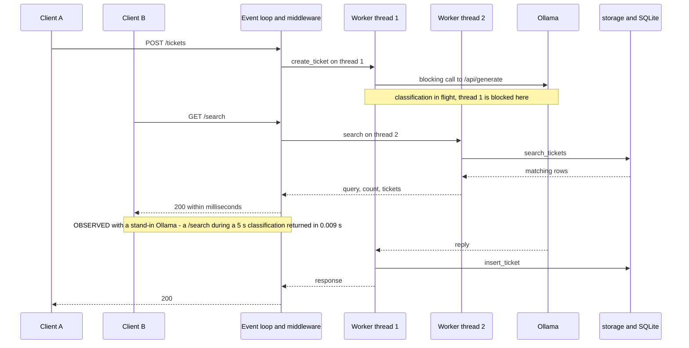
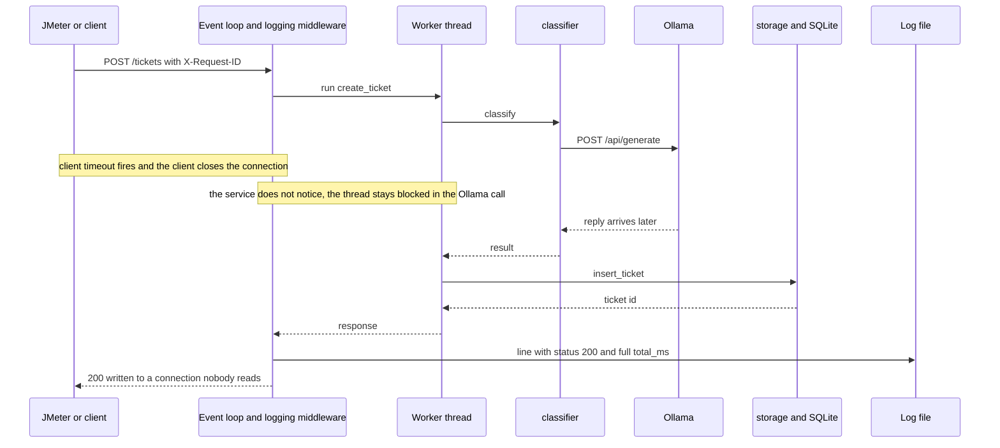

# Triage service: design

This document is for a teammate who did not write the service and needs to load-test it, explain its performance results and draw the architecture slide. For how to start it, switch model, reset storage and run the tests, see [README.md](README.md). This document explains how the service works and why. It describes the code as it is. A statement that was not checked against the code or a run is marked "not verified".

## 1. Purpose and scope

A financial company wants complaint tickets sorted automatically into 7 categories, on CPU-only hardware and without a public model API. This service accepts a ticket over HTTP, asks one local Ollama model for the category, stores the ticket in SQLite, and lets a client search tickets and count them per category. It writes one log line per request so a load test can be reconciled with the service's own record.

It is a deliberately plain baseline: synchronous, no cache, no queue, no retries, no optimisation. The team measures it with JMeter and recommends a model. Optimising it is the next assignment.

| This service owns | Not this service |
| --- | --- |
| The HTTP API (`POST /tickets`, `GET /search`, `GET /stats`) | The prompt, generation settings and answer parser (`evaluation/`, Izzul, frozen, imported unchanged) |
| Ticket storage (SQLite) | The golden set and labels (`golden_set/`, Ernest) |
| Request logging | JMeter plans, `.jtl` files and load analysis (Lutfi) |
| The Docker image and `docker-compose.yml` | Workload model, requirements and prediction record (Mikhail) |
| The startup model and digest check | Ollama itself and its host settings (for example `OLLAMA_NUM_PARALLEL`) |

## 2. System context



The container and Ollama run on the same host, so they share its CPU and RAM. JMeter runs on a separate machine so that load generation does not compete with the service for CPU. Compose publishes port 8000 (`8000:8000`) and maps `host.docker.internal` to the host with `extra_hosts: host-gateway`.

Terms used in this document:

- **Event loop**: the one thread that runs Uvicorn's asynchronous code, including the logging middleware.
- **Middleware**: code that wraps every request. Here it times the request and writes the log line.
- **Worker thread pool**: threads on which FastAPI runs plain `def` endpoints so they do not block the event loop. The pool is AnyIO's default, 40 threads. The code does not change it, and the limit was confirmed by measurement (section 6.4).
- **Digest**: the hash that identifies an exact Ollama model build. `eval_config.json` pins one per model tag.
- **Open-loop load**: the load generator sends requests on a schedule and does not wait for earlier replies.

## 3. Components



`request_log.py` never imports `app.py` or the classifier. `app.py` hands it a callback that returns `(LOG_PATH, MODEL, model digest)` when a request ends. The Dockerfile copies all modules flat into `/app`, so `import classifier` works in the container.

| Module | Single responsibility | Public functions | Must not know about |
| --- | --- | --- | --- |
| `app.py` | HTTP layer: read env config, run the startup check, define the three endpoints, map errors to status codes | `check_model(model, pins, get_tags)`, `lifespan(app)`, endpoints `create_ticket`, `search`, `stats`, model `TicketIn` | SQL, the prompt, parsing rules, the log file format. (It does inspect urllib exception types to tell 504 from 502.) |
| `request_log.py` | One JSON log line per request, for every route and status | `write_log_line(log_path, record)`, `build_record(request, status, started, model, model_digest)`, `add_request_logging(app, get_config)` | SQLite, the classifier, what the extra fields mean (they are opaque) |
| `storage.py` | SQLite only: create table, insert, search, count | `run_sql(db_path, sql, args)`, `init_db`, `insert_ticket`, `search_tickets`, `count_by_category` | HTTP, FastAPI, the classifier, which categories are valid (the caller passes them in) |
| `classifier.py` (frozen) | Build the prompt, call Ollama, parse the answer into a label or `INVALID` | `classify`, `ollama_get`, `ollama_post`, `build_prompt`, `parse_label`, `verify_pins`, `loaded_models`; constants `MODELS`, `LABELS`, `INVALID`, `OPTIONS`, `KEEP_ALIVE`, `REQUEST_TIMEOUT_S`, `OLLAMA_URL` | The web service, storage, logging. The service uses only `classify`, `ollama_get`, `MODELS`, `LABELS`, `INVALID` and `OLLAMA_URL` |
| `eval_config.json`, `prompt_template.md` (frozen) | Data for the classifier: pinned tags and digests, 7 labels, `INVALID` name, generation options, timeout, prompt text | none (data files) | Everything else |

Settings in the frozen files that shape performance:

| Setting | Value | Effect |
| --- | --- | --- |
| `options.num_predict` | 16 | Caps the generated answer at 16 tokens |
| `options.num_ctx` | 4096 | Context window. A longer prompt is silently cut by Ollama; the classifier sets `possibly_truncated` when `prompt_tokens + num_predict >= num_ctx` |
| `options.temperature`, `options.seed` | 0, 42 | Fixed generation settings |
| `keep_alive` | `30m` | Sent with every request; asks Ollama to keep the model loaded 30 minutes after the request (Ollama behaviour, not verified here) |
| `request_timeout_seconds` | 300 | Passed to `urllib.request.urlopen` as the socket timeout (see section 5) |

## 4. Data design



| Column | Meaning |
| --- | --- |
| `id` | `INTEGER PRIMARY KEY AUTOINCREMENT`, returned to the client |
| `narrative` | The ticket text as submitted (not stripped) |
| `category` | One of the 7 labels, or `INVALID` when the parser could not read the answer |
| `model` | The model tag (`MODEL`) that classified it |
| `request_id` | The request's ID. Not unique: a client that reuses an `X-Request-ID` creates duplicates |
| `created_at` | UTC ISO-8601 with milliseconds, set when the row is inserted (after classification) |

There is one table and no index except the primary key, so `GET /search` scans every row. All columns except `id` are `NOT NULL`.

### Log line

The log is `logs/requests.jsonl` on the host (`/logs/requests.jsonl` in the container, path from `LOG_PATH`). It holds one JSON object per line. `build_record` writes the common fields first, then the extra fields the endpoint put in `request.state.extra`, in the order it added them. The narrative text is never logged.

Common fields (every line, every route, including 404 and 422):

| Field | Value |
| --- | --- |
| `ts` | UTC time the line was built, ISO-8601 with milliseconds (the end of the request) |
| `request_id` | `X-Request-ID` header, or a generated `uuid4().hex` (32 characters) |
| `run_id` | `X-Run-ID` header, or `null` |
| `method`, `route` | HTTP method and URL path |
| `status` | HTTP status; 500 if an exception escaped |
| `total_ms` | Milliseconds from the middleware's `time.perf_counter()` start to just before the line is built |
| `model`, `model_digest` | `MODEL`, and its pinned digest from `eval_config.json` (the pin, not a value read from Ollama per request) |

Extra fields:

| Route and case | Extra fields |
| --- | --- |
| `POST /tickets`, 200 | `narrative_chars`, `category`, `raw_output`, `model_ms`, `load_ms`, `prompt_eval_ms`, `eval_ms`, `prompt_tokens`, `output_tokens`, `possibly_truncated`, `ticket_id` |
| `POST /tickets`, 502 or 504 | `narrative_chars`, `error`, `model_ms`. No `ticket_id` |
| `POST /tickets`, 500 because the insert failed after a successful classification | The same model fields as a 200, then `error`. No `ticket_id` |
| `POST /tickets`, 422 | none (the endpoint did not run) |
| `GET /search`, 200 | `query`, `result_count` |
| `GET /stats`, 200 | none |
| Any route, unhandled exception | `error` (`repr` of the exception), status 500 |

The model fields are recorded before the insert and `ticket_id` after it, so a storage failure does not lose the model's result and timings. `model_ms` on success is the classifier's `wall_ms`. On failure it is measured by `app.py` with its own timer around the failed call. `load_ms`, `prompt_eval_ms` and `eval_ms` are Ollama's own `load_duration`, `prompt_eval_duration` and `eval_duration` converted to ms.

The two examples below use illustrative values, not measurements.

A successful `/tickets` (one line, wrapped here by the code block only):

```json
{"ts": "2026-10-03T14:05:12.481+00:00", "request_id": "peak01-000142", "run_id": "peak-qwen7b-01", "method": "POST", "route": "/tickets", "status": 200, "total_ms": 4236.9, "model": "qwen2.5:7b", "model_digest": "845dbda0ea48ed749caafd9e6037047aa19acfcfd82e704d7ca97d631a0b697e", "narrative_chars": 412, "category": "Credit card", "raw_output": "Credit card", "model_ms": 4231.8, "load_ms": 61.2, "prompt_eval_ms": 2950.4, "eval_ms": 1210.7, "prompt_tokens": 148, "output_tokens": 3, "possibly_truncated": false, "ticket_id": 142}
```

A 502 because Ollama refused the connection:

```json
{"ts": "2026-10-03T14:05:13.020+00:00", "request_id": "peak01-000143", "run_id": "peak-qwen7b-01", "method": "POST", "route": "/tickets", "status": 502, "total_ms": 3.8, "model": "qwen2.5:7b", "model_digest": "845dbda0ea48ed749caafd9e6037047aa19acfcfd82e704d7ca97d631a0b697e", "narrative_chars": 388, "error": "URLError(ConnectionRefusedError(111, 'Connection refused'))", "model_ms": 3.4}
```

## 5. API reference

Two request headers apply to every route. Both are optional.

| Header | Direction | Effect |
| --- | --- | --- |
| `X-Request-ID` | request | Used as the request ID, else a UUID is generated. Written to the log and stored in `tickets.request_id`. For `POST /tickets` it is also in the JSON reply |
| `X-Run-ID` | request | Labels a test run. Appears only in the log (`run_id`) |
| `X-Request-ID` | response | Echoes the request ID. Set on every response the app returns, including 404, 422, 502 and 504. Not set when an unhandled exception gives a 500 (the header is set only after `call_next` returns normally) |

### `POST /tickets`

| Item | Detail |
| --- | --- |
| Request | JSON `{"narrative": "<text>"}`. `narrative` must be a string with at least one non-whitespace character. No maximum length |
| Success | 200 `{"id": <int>, "category": "<label or INVALID>", "request_id": "<id>"}` |
| 422 | Missing body, missing or non-string `narrative`, empty or whitespace-only `narrative`. The classifier is not called and nothing is stored |
| 504 | The Ollama call timed out: `TimeoutError`, or `URLError` whose `reason` is a `TimeoutError`. Body `{"detail": "Ollama call timed out"}`. Nothing stored |
| 502 | Any other exception from the Ollama call: connection refused, HTTP error status from Ollama, unreadable JSON. Body `{"detail": "Ollama call failed"}`. Nothing stored |
| 500 | An exception outside the Ollama call, for example `insert_ticket` failing after a successful classification. Nothing is stored. The log line keeps the model fields and adds `error`, with no `ticket_id` |

The timeout is the socket timeout of `urlopen` (300 s). It applies to connecting and to each blocking socket read, not to the whole call. With `stream: false` Ollama sends nothing until the answer is ready, so in practice it is the longest the service waits for the reply.

### `GET /search`

| Item | Detail |
| --- | --- |
| Request | Query parameter `q`, required, at least 1 character |
| Success | 200 `{"query": "<q>", "count": <int>, "tickets": [{"id", "narrative", "category", "model", "created_at"}]}` |
| Matching | Literal substring of `narrative` (`instr(lower(narrative), lower(?))`), so `%` and `_` are literal. Case is ignored for ASCII letters only: with `CAFÉ` stored, `q=café` finds nothing (measured). Ordered by `id`. No limit |
| 422 | `q` missing or empty |
| 500 | Unhandled exception, for example a database error |

### `GET /stats`

| Item | Detail |
| --- | --- |
| Request | No parameters |
| Success | 200 `{"total": <int>, "by_category": {...}}` with 8 keys: the 7 labels in `eval_config.json` order, then `INVALID`. Zeros are included |
| Errors | 500 only on an unhandled exception |

Any other path returns FastAPI's 404, and a wrong method returns 405. Both are logged. FastAPI's default `/docs`, `/redoc` and `/openapi.json` are not disabled in the code, so they exist and would be logged too. Keep them out of the load test.

## 6. Request flows

In the diagrams, "worker thread" is the thread on which the endpoint function runs.

### 6.1 Startup and model check



- Every failure branch ends the process with one `STARTUP ERROR: ...` line. Uvicorn then reports `Application startup failed` and the container exits with code 3 (measured for an unpinned model, unreachable Ollama and a digest mismatch). The compose file has no restart policy, so the container stays stopped.
- Only the selected model is checked, not all four.
- Startup does not call `/api/generate`. The first `POST /tickets` pays Ollama's model load time (`load_ms`). Send one warm-up request before measuring. After the model has been idle longer than `keep_alive` it may load again (expected from Ollama's behaviour, not verified).
- If `MODEL` is not set, the code sees an empty string and fails the first branch. Compose refuses to start without it.

### 6.2 `POST /tickets`, success



- `total_ms` covers: body read and validation, the wait for a worker thread, the endpoint (classification plus insert), and building the response. It does not cover time before the middleware starts its timer, or sending the reply: the log line is written before the response is sent.
- `model_ms` covers only the `ollama_post` call inside `classifier.classify`, including the time Ollama holds the request in its own queue. It does not cover waiting for a worker thread, parsing the label, or the insert.
- The `ollama_post` call blocks its worker thread for the whole duration. One in-flight classification uses one thread.
- The insert happens after classification, so a ticket cannot be found by `/search` until its classification is done.
- `ts` is the time the line was built. The start time is approximately `ts` minus `total_ms`.

### 6.3 `POST /tickets`, Ollama fails or times out



- Nothing is stored. A failed request leaves no row, so `/stats` totals only count successes.
- A 504 line is expected to show `model_ms` close to 300000 (the socket timeout; any wait for a worker thread is outside `model_ms`). A fast 502 (a few ms) means Ollama was unreachable. A slow 502 means the call failed after a wait. What Ollama returns when it is overloaded is not verified.
- The 300 s timeout starts when the worker thread calls Ollama, not when the request arrived. The service has no timeout on waiting for a thread.
- The service does not retry. The client sees the failure at once.
- Failed lines have no `load_ms`, `prompt_eval_ms` or `eval_ms`, so the derived quantities in section 6.7 apply only to successes.

### 6.4 `POST /tickets` under concurrent load



Measured in Docker with a stand-in Ollama. The stand-in answers every call in parallel after a fixed delay, so these runs show the service's own behaviour, not Ollama's queueing.

| Run | Result |
| --- | --- |
| 45 concurrent POSTs, 8 s reply | The first 40 ran at once: `total_ms` 8000 to 8946, `model_ms` about 7990. The 5 late ones waited for a thread: `total_ms` 15823 to 15862 with `model_ms` about 7973, so `total_ms - model_ms` was 7849 to 7888 ms |
| `GET /search` and `GET /stats` sent 1.5 s into that run | Both waited for a thread: `total_ms` 6565 and 6526 ms |
| 20 concurrent POSTs, 8 s reply, same search and stats | Immediate: `total_ms` 5.1 and 9.3 ms. POST `total_ms` 7998 to 8467 |
| 100 concurrent POSTs with no delay, plus 200 sequential searches | All 300 returned 200. No `database is locked`. Every log line was valid JSON with a unique `request_id` |
| Inserts that finish together | When 20 to 40 tickets completed at the same moment, `total_ms - model_ms` reached about 0.5 to 0.93 s. That is time waiting for SQLite's single writer |

Expected from the design, to be confirmed by the load and stress tests with real Ollama:

- With `OLLAMA_NUM_PARALLEL=1`, concurrent classifications queue inside Ollama and `model_ms` grows with queue depth. Roughly, a request with `n` generations ahead of it waits `n` times the compute time of one.
- The 300 s timeout counts time queued inside Ollama. A request behind about `300 / seconds per classification` others gets a 504 from queueing alone (for example about 37 others at 8 s each).
- With real Ollama at `OLLAMA_NUM_PARALLEL=1`, classifications finish one at a time, so the SQLite writer wait should be much smaller than in the stand-in runs.
- Not measured: how Ollama queues or rejects requests when overloaded, and whether it stops work for a request whose caller has gone away.

Notes:

- Two queues exist in series: the thread pool in front, Ollama's own queue behind. The log tells them apart (section 6.7).
- Each waiting `/tickets` request holds an open client connection, a worker thread and an Ollama call. The service has no limit on how many requests it accepts.
- At the workload model's peak (23 tickets and 46 searches per hour) the pool is nowhere near full. The 40-thread limit matters for the stress test.

### 6.5 `GET /search` while a classification is in flight



- The observed run: the 5 s classification had `total_ms` 5004.6 and `model_ms` 4993.9.
- `/search` is fast here because the event loop is free (the blocking call is on a thread), a thread is free, and the search does not touch Ollama.
- `/search` and `/stats` share the 40-thread pool with classifications. Once 40 classifications are in flight they wait for a thread like any other request (measured, see 6.4: about 6.5 s with 45 in flight, about 5 ms with 20).
- Search time also depends on the table: it scans every row and returns every match, so it grows with the number of stored tickets and matches. A fresh service is empty, so search timings depend on how many tickets earlier POSTs created.
- Search and insert use separate SQLite connections. The code sets no journal mode, so SQLite's default applies. A read and an insert can make each other wait, up to the 30 s busy timeout. In a run of 200 searches alongside 100 concurrent POSTs the search `total_ms` had a median of 2.3 ms and a maximum of 284 ms, with no lock errors (measured).

### 6.6 Client gives up early



- Measured with a stand-in Ollama: `curl -m 2` against a 6 s reply. Nothing was logged when the client left. When the Ollama call completed at 6 s, the ticket was stored and one line was logged with status 200 and `total_ms` 5998.7.
- Reconciliation: the `.jtl` row is a failure (timeout), the log row for the same `request_id` is a 200, and the ticket exists. So the log can show more successes than JMeter, and `/stats` can count tickets JMeter reported as failed.
- This only works if JMeter sends a unique `X-Request-ID` on every request. If it does not, the service generates an ID, and a request that timed out never received it, so it cannot be matched to a log line by ID. The same applies to a 500, whose response carries no `X-Request-ID` header.
- Under overload this can add load: abandoned requests still occupy a thread and an Ollama call (expected from the design; whether Ollama cancels abandoned generations is not verified).

### 6.7 Reading the log to find the bottleneck

Two derived quantities, for successful `POST /tickets` lines. Both are approximations.

```text
wait before the endpoint ran + service overhead  ~  total_ms - model_ms
time queued inside Ollama + HTTP overhead        ~  model_ms - (load_ms + prompt_eval_ms + eval_ms)
```

The first includes waiting for a worker thread, body validation, the insert (including any wait for SQLite's single writer), and building the reply. It is not pure thread wait. The second includes time Ollama held the request in its queue, connection set-up, and reading and decoding the reply. Ollama's `load_ms`, `prompt_eval_ms` and `eval_ms` are compute and load time only. To find time outside the service, compare the JMeter elapsed time with `total_ms` for the same `request_id`.

| Symptom in the log | Likely place the time went |
| --- | --- |
| `model_ms` close to `load_ms + prompt_eval_ms + eval_ms`, and `total_ms - model_ms` small | Ollama compute on CPU; the model is the limit |
| `model_ms` far above `load_ms + prompt_eval_ms + eval_ms` | Queued inside Ollama behind other generations, or slow HTTP to Ollama |
| `total_ms - model_ms` of several seconds, `model_ms` normal | Waited for a free worker thread (40 or more requests in flight) |
| `total_ms - model_ms` up to about a second on requests that finished together | Waited for SQLite's single writer |
| `load_ms` large on the first request or after an idle period | Model load (cold start); send a warm-up before measuring |
| `prompt_eval_ms` and `prompt_tokens` high | Long narrative; check `possibly_truncated` |
| `/search` `total_ms` rises while POSTs are in flight | Thread pool full, or a large result (`result_count`), or many stored tickets |
| 504 with `model_ms` near 300000 | Ollama did not reply within the 300 s socket timeout |
| 502 with `model_ms` of a few ms | Ollama refused the connection or is down |
| 200 in the log, failure in the `.jtl` | Client gave up early (6.6) |

## 7. Design decisions

| Decision | Reason | Alternative rejected |
| --- | --- | --- |
| FastAPI with plain `def` endpoints | The Ollama call is blocking `urllib`. On a thread, a slow classification does not stop `/search` and `/stats` from being served | `async def` endpoints with the blocking call (would freeze the event loop); an async HTTP client (the classifier is frozen and uses `urllib`) |
| One Uvicorn worker process | Keeps the baseline plain: one event loop, one pool, one place where log lines are written. Multi-process tuning belongs to the optimisation assignment | `--workers N`, Gunicorn |
| SQLite on a named volume | Tickets are few (tens per hour in the workload model) and the service needs no separate server. The volume lives in Docker, apart from the log, so `docker compose down -v` resets tickets only | A database container (more moving parts to deploy and measure) |
| JSON Lines log on a bind mount | One JSON object per line is easy to load into an analysis tool. On the host it can be read while the service runs and survives `down -v` | Container stdout; a log table in SQLite |
| Import the frozen classifier through the Docker build context | One source of truth: `evaluation/` stays unchanged and nothing is copied into `service/`. `.dockerignore` keeps `golden_set`, `logs` and `.git` out of the context, and `data.py` is not copied | Copy `classifier.py` into `service/` (as `evaluation/README.md` suggests) |
| Ollama on the host | Ollama and its settings are outside this service's scope and owned by the team. The pinned models are already pulled there | Ollama as a second container |
| Fail-fast digest check at startup | A load result is only valid for the pinned model. Refusing to start is better than serving a different model silently | Warn and continue; check on every request (extra latency) |
| Store `INVALID` answers | Every submitted ticket is kept and counted. Unparseable replies stay visible in `/stats` and `raw_output` is logged | Return an error and store nothing; retry the model (not in the baseline) |
| No limit on `/search` | Returns all matching stored tickets, as the brief asks. A limit or pagination is an optimisation | `LIMIT`, pagination |
| Request and run IDs from headers | JMeter can set `X-Request-ID` so each `.jtl` row can be matched to a log line and a stored ticket. `X-Run-ID` labels a test run. Without the header a UUID is generated | Service-generated IDs only (failed or timed-out requests could not be matched) |
| Narrative never logged | Complaint text may contain personal details. `narrative_chars` records the size instead | Log the text |
| New SQLite connection per call, 30 s busy timeout | No shared connection state between threads; a writer that finds the database locked waits up to 30 s instead of failing at once | One shared connection; a connection pool |

## 8. Baseline constraints and known limits

These are deliberately not done. This section lists them and what a tester should expect. It does not recommend fixes.

- **No cache.** The same narrative sent twice is classified twice. Every `POST /tickets` costs a full Ollama call.
- **No queue.** The service has no admission control and no limit on waiting requests. The only limit on concurrent classifications is the 40-thread pool. Beyond it, requests wait on the event loop with no service-side timeout, so overload shows as long `total_ms`, not as errors from the service.
- **No retries.** A 502 or 504 goes straight to the client and nothing is stored.
- **No pagination or limit on `/search`.** Reply size and time grow with stored tickets and matches. The search is a full table scan with no index.
- **One worker process.** One event loop and one pool. All log lines are written from the event loop, so lines do not interleave; each write is a blocking open-append-close on that loop.
- **No authentication, no rate limiting, no TLS.** Plain HTTP on port 8000.
- **No model warm-up and no health endpoint.** The first classification pays the model load. There is no `HEALTHCHECK` and no resource limits in the compose file.
- **No limit on narrative length.** A narrative that makes the prompt exceed `num_ctx` (4096) is cut by Ollama; `possibly_truncated` flags it, but the request still succeeds.
- **No log rotation.** The log is appended to forever and survives restarts and `down -v`. A new run needs a way to be told apart: use `X-Run-ID`.
- **Case folding is SQLite's `lower()`.** It folds ASCII letters only, so search is not case-insensitive for accented or non-Latin text (measured).
- **Stopping drops requests in flight.** `docker compose stop` and `down` wait 10 s and then kill the container. A request still running gets no reply and no log line (measured). Stop the service only after the load generator has finished.
- **One model at a time.** Tickets record which model classified them. Switching model needs a storage reset (see `README.md`).
- **Timing covers the service only.** `total_ms` starts when the middleware starts and ends before the reply is sent. Connection set-up, network time and sending the body are only in JMeter's own timings. Through Docker Desktop a client measured about 5 to 20 ms more than `total_ms` per request.

## 9. Requirements traceability

| Requirement | Implemented in | Tests |
| --- | --- | --- |
| Service runs in Docker | `service/Dockerfile` (`python:3.12-slim`, `uvicorn app:app --host 0.0.0.0 --port 8000`), `docker-compose.yml` | No automated test. Checked by hand in Docker with a stand-in Ollama |
| `POST /tickets` accepts one narrative, classifies via the model backend, stores, returns the category | `app.create_ticket` -> `classifier.classify` -> `storage.insert_ticket` | `test_app_unit.py` (id, category and request_id returned; classify and insert called once; `INVALID` stored; 422 cases; 502 and 504), `test_integration.py` (post then search then stats agree; real prompt built; failures store nothing) |
| `GET /search` returns stored tickets matching a text query | `app.search` -> `storage.search_tickets` | `test_storage.py` (substring, case, `%` and `_` literal, order, empty), `test_app_unit.py` (422 without `q`; reply shape), `test_integration.py` |
| `GET /stats` returns counts by category | `app.stats` -> `storage.count_by_category` | `test_storage.py` (zeros, correct counts), `test_app_unit.py` (8 keys), `test_integration.py` |
| Service starts empty, no bulk import | `storage.init_db` only creates the table (`CREATE TABLE IF NOT EXISTS`); no import code; the Dockerfile does not copy `data.py` and `.dockerignore` excludes `golden_set` | `test_storage.py` (`init_db` creates the table and keeps existing tickets), `test_integration.py` (`/stats` total 0 after startup) |
| Classification is synchronous, no caching or queuing | `app.create_ticket` calls `classifier.classify` directly; no cache or queue code exists | Absence is checked by reading the code, not by a test. `test_app_unit.py` checks one `classify` call per POST |
| Ollama model pinned by tag and digest | `eval_config.json` `models`; `app.check_model` and `app.lifespan`; `model` and `model_digest` in every log line | `test_app_unit.py` (`check_model` pass, unknown model, not pulled, digest mismatch, unreachable; startup exit and table creation), `test_integration.py` (startup check) |
| Every handled request is logged | `request_log.add_request_logging`, `build_record`, `write_log_line` | `test_request_log.py` (writer, record builder, and the middleware on a bare app: 200, 404, 405, 500), `test_integration.py` (one valid line per request for 200, 422, 404, 405, 502 and a 500 from a failed insert; fields; real durations; no narrative text) |
| Logs reconcile with JMeter result files (request IDs) | `X-Request-ID` read in the middleware, echoed in the header and reply, stored in `tickets.request_id`, logged; `X-Run-ID` logged | `test_integration.py` (IDs echoed and logged; generated when absent; stored ID equals logged ID). The client-abort mismatch (6.6) is not in automated tests |

## 10. Test strategy

For the command to run the automated tests, see the Tests section of [README.md](README.md).

| Level | Covers | Real | Replaced by a stub | Where |
| --- | --- | --- | --- | --- |
| Unit | One module each: SQL behaviour, log record building and writing, the logging middleware, endpoint mapping and `check_model` | `storage` and `request_log` on temp files; the FastAPI routing in `TestClient` | In `test_app_unit.py`: `classifier.classify`, `classifier.ollama_get`, the storage functions. In `test_request_log.py`: the request object, and a bare app with dummy routes in place of the real endpoints | `service/tests/test_storage.py`, `test_request_log.py`, `test_app_unit.py` |
| Integration | The modules together: post, search and stats agree; failures store nothing; one valid log line per request; IDs match; startup check | `app`, `storage` (temp SQLite), `request_log` (temp file), the classifier's prompt building and parser | Only `classifier.ollama_post` and `classifier.ollama_get` (the Ollama HTTP calls) | `service/tests/test_integration.py` |
| System check in Docker | The built image and Compose file: container starts, reaches the host through `host.docker.internal`, serves requests, keeps the volume and log; the concurrency and client-abort behaviour in 6.4 to 6.6 | The image, Uvicorn, volume, bind mount, network path | Ollama is a stand-in server on the host with a fixed reply delay | Run by hand. No script for it is in the repo |

Not covered by automated tests:

- Real Ollama: real prompts and answers, real latencies, `load_ms`, real digests and real error replies.
- Real timeouts: unit and integration tests raise `TimeoutError` directly. The 300 s wait is never exercised.
- Load: Ollama queueing and behaviour at scale. Thread-pool waits and SQLite contention were measured by hand with a stand-in Ollama (section 6.4), not by automated tests.
- The client-abort case (6.6) and stopping the container with requests in flight (measured by hand), and the Linux host network case from `README.md` (not tested).
